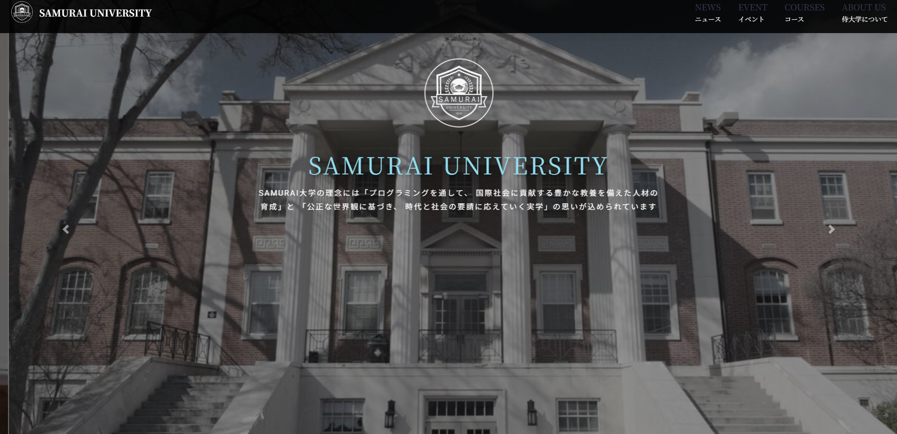
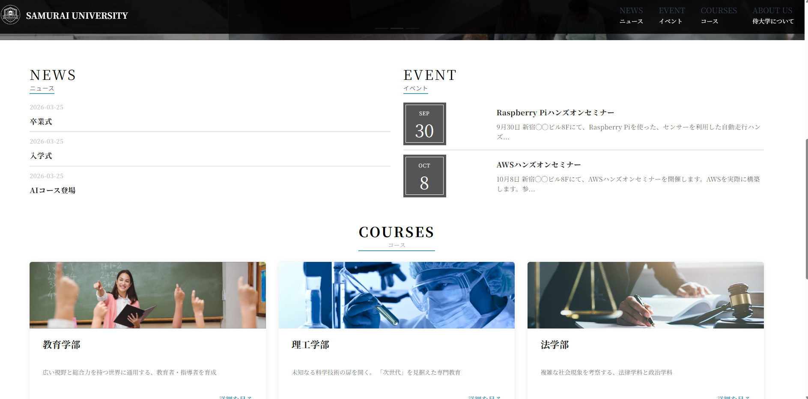
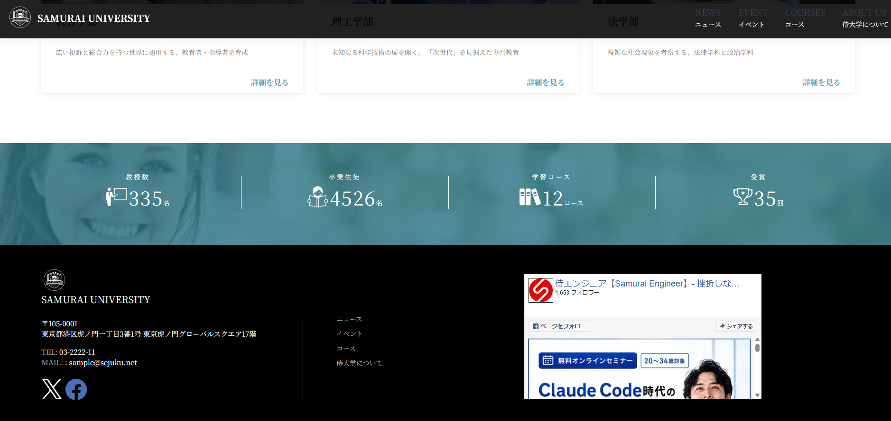

# WordPress Original Theme

#概要
WordPressテーマ開発を学ぶために制作したオリジナルテーマです。

## スクリーンショット

### トップページ

### コース一覧

### コース詳細

## 使用技術
- WordPress
- PHP
- HTML
- CSS
- JavaScript

## 実装内容
- オリジナルテーマ化
- カスタム投稿
- レスポンシブ対応
- 記事一覧表示
- 投稿詳細ページ
- お問い合わせページ

## 学習目的
WordPressテーマ開発の基礎を学ぶために制作しました。
